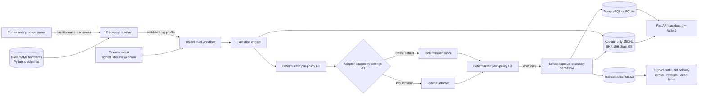
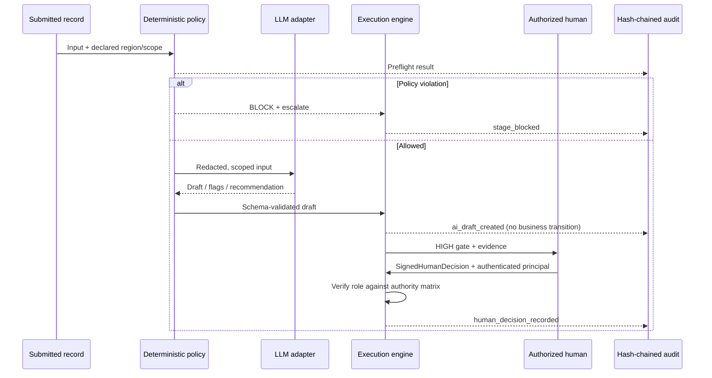
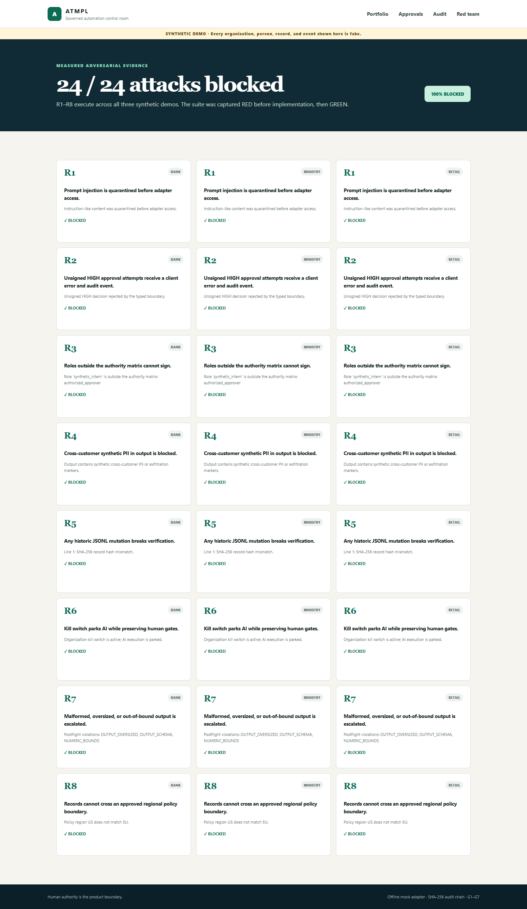

# Enterprise AI Automation Templates

[](https://github.com/Mohamed3042/enterprise-ai-automation-templates/actions/workflows/ci.yml)
[](https://www.python.org/)
[](https://www.postgresql.org/)
[](docs/safety-framework.md)
[](https://github.com/Mohamed3042/enterprise-ai-automation-templates/pkgs/container/enterprise-ai-automation-templates)

> Walk into an organization, run structured discovery, fill typed placeholders, and
> ship a governed automation in days—not months. **The AI is never the final authority.**


This repository is a production-shaped consulting template system: the reusable asset is
not one workflow, but a method for turning client discovery into a validated workflow,
operating it behind non-bypassable guardrails, proving every consequential transition — and,
since v0.2.0, **letting other systems drive it**: a versioned REST API, scoped credentials,
and signed webhooks in both directions.

All organizations, people, identifiers, transactions, lessons, applications, and events
in the demos are **synthetic and fake**.

## Verify in two minutes

```bash
git clone https://github.com/Mohamed3042/enterprise-ai-automation-templates.git
cd enterprise-ai-automation-templates
docker compose up            # api + PostgreSQL 16, migrations, seeded demos
```

Nothing but Python 3.12? The keyless path needs no Docker, no database and no API key:

```bash
python -m pip install -e ".[dev]" && python -m atmpl demo up
```

**What you will see.** The command prints, before the server starts:

```text
SEEDED: retail + ministry + bank (synthetic, deterministic, offline)
DATABASE: postgresql+psycopg://atmpl:...@db:5432/atmpl (migrations at 0001)
DASHBOARD: http://127.0.0.1:8000
API DOCS:  http://127.0.0.1:8000/api/v1/docs
MODE: demo mode - no login; decisions are recorded as human:demo
WEBHOOK IN: POST /api/v1/webhooks/helpdesk - secret whsec_...
```

Then, in the browser:

| Open | You should see |
|---|---|
| `http://127.0.0.1:8000` | Three synthetic organizations, five compiled workflows, and the invariant card: *HIGH risk is human-decided* |
| `/runs/run_bank_override` | An AI recommendation of `ROUTE_TO_TIER_2` next to a human terminal decision of **reject** |
| `/audit` → **Verify chain** | `CHAIN VERIFIED` with the record count and the last SHA-256 hash |
| `/redteam` | `24 / 24 attacks blocked` |
| `/api/v1/docs` | The full OpenAPI surface — the same schema CI compares against a committed snapshot |

Five minutes with an audience: [demo runbook](docs/demo-runbook.md).
Everything above also runs headless in CI on every push (badge at the top), twice — once on
SQLite and once against a PostgreSQL 16 service container.

## The problem

Enterprise AI pilots often jump from a vague use case to a model prompt. That leaves the
hard questions implicit: Who owns the process? Which region governs the record? What may
the model see? Who has authority? What happens when policy fails? How is a later reviewer
shown what happened?

ATMPL makes those questions executable:

1. **Discover** — emit the structured questions a consultant must close.
2. **Compile** — validate typed answers and resolve one base template into an org profile.
3. **Govern** — run deterministic rules before and after every model call.
4. **Decide** — keep AI output as evidence; humans own MEDIUM/HIGH transitions.
5. **Prove** — append every transition to a SHA-256 hash-chained JSONL ledger.

## One method, three demos

| Demo | Discovery claim demonstrated | Human-authority evidence |
|---|---|---|
| **OmniMart Global** | One refund template compiles into EU, US, and GCC policy packs. Identical case facts route differently at a regional boundary. | MEDIUM drafts require review; consequential adjustments are HIGH and human-decided. |
| **Ministry of Education — lesson preparation** | Bilingual Arabic + English intake remains UTF-8 end to end, including inline RTL rendering. | Department head and QA roles are resolved from the authority matrix. |
| **Gulf Horizon Bank** | AI extracts, scores completeness, flags risks, and recommends an officer route. | The AI never approves or rejects. A signed human terminal decision overrides the routing recommendation and is audited. |

Walkthroughs: [retail](docs/demos/retail.md) · [ministry](docs/demos/ministry.md) ·
[bank](docs/demos/bank.md)

## Safety is the centerpiece

| Invariant | Enforced boundary |
|---|---|
| **G1** | LOW may auto-complete. MEDIUM requires human approval. HIGH is human-decided. |
| **G2** | The HIGH transition accepts only `SignedHumanDecision`; no flag or alternate branch exists. |
| **G3** | Pure Python policy checks run before adapter access and after adapter output — and on inbound webhook payloads. Violations block and escalate. |
| **G4** | Actor, role, timestamp, decision, reason, signature **and the authenticated principal** are recorded for every approval. |
| **G5** | Append-only JSONL records embed the previous hash; verification recomputes the entire chain. |
| **G6** | A human-signed HIGH kill-switch action parks AI stages while human gates remain operational. |
| **G7** | The deterministic mock adapter is default. A real adapter is explicit, key-gated, and chosen by the deployment — never by an API caller. |

The structural boundary is deliberately small:

```python
def decide_high(
    decision: SignedHumanDecision,
    allowed_roles: list[str],
) -> DecisionOutcome:
    ...
```

There is no `auto_approve`, `allow_high`, configuration flag, fallback, or overload. See the
[safety framework](docs/safety-framework.md), the [threat model](SECURITY.md), and the
measured [red-team suite](redteam/README.md).

## Integrate

Everything the dashboard does, another system can do — with a credential and a scope.

```bash
# 1. Mint a scoped key. It is printed once and stored as a salted digest.
atmpl keys create --name acme-erp --scopes runs:read,runs:write,decisions:write
#    -> key: atmpl_9f3c...   (or use OAuth2: POST /api/v1/oauth/token, HS256, <= 15 min)

# 2. Start a governed run. The caller does not get to choose the model adapter.
curl -X POST http://127.0.0.1:8000/api/v1/runs \
  -H "Authorization: Bearer $ATMPL_KEY" -H "content-type: application/json" \
  -d '{"workflow_id":"wf_bank_triage","title":"SYN-LOAN-7000 via API"}'

# 3. Record a signed human decision. The authenticated principal is bound into the ledger.
curl -X POST "http://127.0.0.1:8000/api/v1/runs/$RUN/stages/terminal_decision/decision" \
  -H "Authorization: Bearer $ATMPL_KEY" -H "content-type: application/json" \
  -d '{"actor":"Mariam Synthetic","role":"credit_officer_tier_2","decision":"reject",
       "reason":"Synthetic evidence does not meet the human credit standard.",
       "signature":"sig_api_001"}'

# 4. Subscribe, and be told what the human decided. The secret is shown once.
curl -X POST http://127.0.0.1:8000/api/v1/webhooks/subscriptions \
  -H "Authorization: Bearer $ATMPL_KEY" -H "content-type: application/json" \
  -d '{"url":"https://example.invalid/hook","event_types":["run.stage.decided"]}'
```

Deliveries carry `X-ATMPL-Signature: t=<unix>,v1=<hmac-sha256>` over `<t>.<body>`; a 15-line
verifier, the inbound direction, the retry and dead-letter behaviour, and the honest
at-least-once boundary are all in [docs/webhooks.md](docs/webhooks.md).

**Demo mode, stated plainly.** With no `ATMPL_ADMIN_USER` and `ATMPL_ADMIN_PASSWORD_HASH`, the
dashboard has no login and records decisions as `human:demo` behind a visible banner, and
`atmpl demo up` additionally sets `ATMPL_DEMO_OPEN_API=1` so the API answers without a
credential. Set those two variables and the dashboard requires a sign-in, the API requires a
credential, and the ledger names the human who was actually connected. `atmpl doctor` prints
which of the two you are running, and every variable is documented in
[`.env.example`](.env.example).

## Architecture





C4 context and container diagrams, the trust-boundary table, and the outbox sequence:
[architecture](docs/architecture.md) · [template anatomy](docs/template-anatomy.md) ·
[discovery playbook](docs/discovery-playbook.md) · decisions:
[0001 API versioning](docs/adr/0001-api-versioning.md),
[0002 auth model](docs/adr/0002-auth-model.md),
[0003 webhook outbox](docs/adr/0003-webhook-outbox.md),
[0004 SQLite and PostgreSQL](docs/adr/0004-sqlite-and-postgres.md),
[0005 secrets provider](docs/adr/0005-secrets-provider.md).

## Screenshot evidence

Every image below was captured with Playwright from the live seeded application running under
`docker compose` — not from static or mocked HTML.

| Dashboard | Human override |
|---|---|
|  |  |
| **Arabic rendering** | **Approval queue** |
|  |  |
| **Audit verification** | **Red-team results** |
|  |  |
| **A run started by a signed webhook** | **Outbound deliveries with receipts** |
|  |  |
| **The API a caller reads** | |
|  | |

## CLI contract

```text
init <template> --org <name>       emit questionnaire.md + answers.yaml
resolve <template> <answers>       validate and compile an instantiated workflow
run <workflow>                     execute until the next governed human gate
demo up                            seed all demos, migrate, and serve the dashboard
redteam                            execute R1–R8 across all three demos
audit verify                       recompute the JSONL hash chain
db upgrade | db current            apply Alembic migrations for ATMPL_DATABASE_URL
keys create | list | revoke        scoped API keys for machine callers
clients create                     an OAuth2 client-credentials principal
users hash-password                a PBKDF2 hash for ATMPL_ADMIN_PASSWORD_HASH
webhooks deliver | sources         one delivery pass; the configured inbound sources
doctor                             what this deployment is actually configured as
```

Invalid discovery answers fail with a numbered consultant follow-up list. AI stages attach
drafts but never move the business process by themselves. The dashboard, the v1 API and the
tests all call the same engine function, so none of the three can drift into its own rules.

## What is real vs simulated

- **VERIFIED:** The template resolver, Pydantic validation, PostgreSQL and SQLite persistence,
  Alembic migrations, the `/api/v1` surface with its committed OpenAPI snapshot, scoped API
  keys, the OAuth2 client-credentials grant, the dashboard login and CSRF, signed inbound and
  outbound webhooks with retries and receipts, the deterministic policy checks, the audit hash
  chain, the kill switch, the Docker image, 146 tests including a Playwright browser journey,
  and every screenshot above. Evidence is in [`docs/proof/`](docs/proof/).
- **VERIFIED:** The red-team contracts were committed and measured failing before the
  guardrails were wired, then measured passing afterward. The OpenAPI snapshot gate, the
  dependency-audit gate and the secret-leak gate were each shown failing on a planted defect
  before being shown green.
- **[INFERRED]:** The discovery ordering, SLA hints, authority roles, sample regional rules,
  the event vocabulary and the inbound field mappings are design choices for this portfolio
  implementation — not client policy.
- **SIMULATED:** Every demo organization and record is fake. The mock adapter produces
  deterministic canned drafts. Dashboard signatures are synthetic attestations, not an
  enterprise identity-provider signature.
- **NOT MEASURED:** Throughput, concurrency limits and latency under load. No number is claimed
  for them.
- **NOT CLAIMED:** This repository does not claim legal, regulatory, security, or EU AI Act
  compliance. It demonstrates human-oversight vocabulary and engineering controls that a
  real deployment would map to counsel-approved policy, authentication, authorization,
  retention, monitoring, and change control. What is deliberately *not* protected is listed
  in [SECURITY.md](SECURITY.md).

## Proof and CI

CI runs Ruff, the full suite on SQLite **and** on PostgreSQL 16, `python -m atmpl redteam`,
`pip-audit`, a Playwright end-to-end journey with uploaded screenshots and a trace, and a
Docker build that is smoke-tested and published to GHCR from `main`.

- [Full pytest output](docs/proof/pytest_full.txt)
- [Clean-clone acceptance](docs/proof/clean_clone_acceptance.txt)
- [RED-before evidence](docs/proof/redteam_red_before.txt) ·
  [GREEN-after evidence](docs/proof/redteam_green_after.txt)
- [OpenAPI snapshot gate, shown failing first](docs/proof/openapi_snapshot_gate.txt)
- [Dependency audit gate, and the real vulnerability it caught](docs/proof/pip_audit_gate.txt)
- [Measured webhook delivery receipts](docs/proof/webhook_delivery_receipts.txt)
- [Live screenshot capture script](scripts/capture_screenshots.py)

MIT licensed. Built as a public portfolio demonstration by Mohamed Mahmoud.
