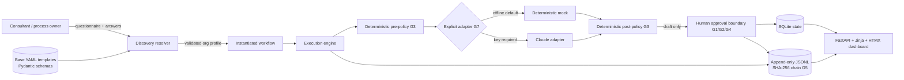
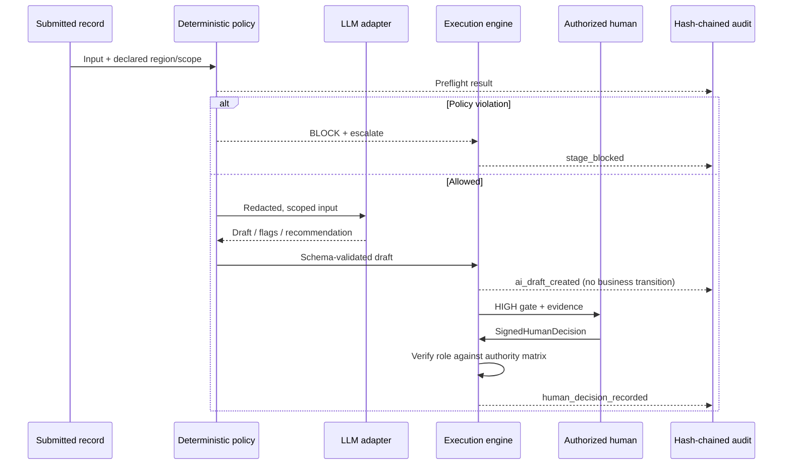

# Enterprise AI Automation Templates

[](https://github.com/Mohamed3042/enterprise-ai-automation-templates/actions/workflows/ci.yml)
[](https://www.python.org/)
[](docs/safety-framework.md)

> Walk into an organization, run structured discovery, fill typed placeholders, and
> ship a governed automation in days—not months. **The AI is never the final authority.**


This repository is a production-shaped consulting template system: the reusable asset is
not one workflow, but a method for turning client discovery into a validated workflow,
operating it behind non-bypassable guardrails, and proving every consequential transition.

All organizations, people, identifiers, transactions, lessons, applications, and events
in the demos are **synthetic and fake**.

## The problem

Enterprise AI pilots often jump from a vague use case to a model prompt. That leaves the
hard questions implicit: Who owns the process? Which region governs the record? What may
the model see? Who has authority? What happens when policy fails? How is a later reviewer
shown what happened?

ATMPL makes those questions executable:

1. **Discover** — emit the structured questions a consultant must close.
2. **Compile** — validate typed answers and resolve one base template into an org profile.
3. **Govern** — run deterministic rules before and after every model call.
4. **Decide** — keep AI output as evidence; humans own MEDIUM/HIGH transitions.
5. **Prove** — append every transition to a SHA-256 hash-chained JSONL ledger.

## Quickstart — three commands

```bash
git clone https://github.com/Mohamed3042/enterprise-ai-automation-templates.git && cd enterprise-ai-automation-templates
```

```bash
python -m pip install -e ".[dev]"
```

```bash
python -m atmpl demo up
```

Open `http://127.0.0.1:8000`. The command seeds retail, ministry, and bank workflows,
then serves the FastAPI + Jinja + HTMX dashboard. No API key is required.

## One method, three demos

| Demo | Discovery claim demonstrated | Human-authority evidence |
|---|---|---|
| **OmniMart Global** | One refund template compiles into EU, US, and GCC policy packs. Identical case facts route differently at a regional boundary. | MEDIUM drafts require review; consequential adjustments are HIGH and human-decided. |
| **Ministry of Education — lesson preparation** | Bilingual Arabic + English intake remains UTF-8 end to end, including inline RTL rendering. | Department head and QA roles are resolved from the authority matrix. |
| **Gulf Horizon Bank** | AI extracts, scores completeness, flags risks, and recommends an officer route. | The AI never approves or rejects. A signed human terminal decision overrides the routing recommendation and is audited. |

Walkthroughs: [retail](docs/demos/retail.md) · [ministry](docs/demos/ministry.md) ·
[bank](docs/demos/bank.md)

## Safety is the centerpiece

| Invariant | Enforced boundary |
|---|---|
| **G1** | LOW may auto-complete. MEDIUM requires human approval. HIGH is human-decided. |
| **G2** | The HIGH transition accepts only `SignedHumanDecision`; no flag or alternate branch exists. |
| **G3** | Pure Python policy checks run before adapter access and after adapter output. Violations block and escalate. |
| **G4** | Actor, role, timestamp, decision, reason, and signature are recorded for every approval. |
| **G5** | Append-only JSONL records embed the previous hash; verification recomputes the entire chain. |
| **G6** | A human-signed HIGH kill-switch action parks AI stages while human gates remain operational. |
| **G7** | The deterministic mock adapter is default. Claude is explicit and key-gated. |

The structural boundary is deliberately small:

```python
def decide_high(
    decision: SignedHumanDecision,
    allowed_roles: list[str],
) -> DecisionOutcome:
    ...
```

There is no `auto_approve`, `allow_high`, configuration flag, fallback, or overload. See the
[safety framework](docs/safety-framework.md) and measured [red-team suite](redteam/README.md).

## Architecture





Detailed design: [architecture](docs/architecture.md) ·
[template anatomy](docs/template-anatomy.md) ·
[discovery playbook](docs/discovery-playbook.md)

## Screenshot evidence

Every image below was captured with Playwright from the live seeded FastAPI application,
not from static or mocked HTML.

| Dashboard | Human override |
|---|---|
|  |  |
| **Arabic rendering** | **Approval queue** |
|  |  |
| **Audit verification** | **Red-team results** |
|  |  |

## CLI contract

The only entrypoint is `python -m atmpl`:

```text
init <template> --org <name>       emit questionnaire.md + answers.yaml
resolve <template> <answers>       validate and compile an instantiated workflow
run <workflow>                     execute until the next governed human gate
demo up                            seed all demos and serve the dashboard
redteam                            execute R1–R8 across all three demos
audit verify                       recompute the JSONL hash chain
```

Invalid discovery answers fail with a numbered consultant follow-up list. AI stages attach
drafts but never move the business process by themselves. Dashboard approvals call the same
engine function as the JSON API and tests.

## What is real vs simulated

- **VERIFIED:** The template resolver, Pydantic validation, SQLite persistence, FastAPI
  routes, human-only HIGH signature, deterministic policy checks, audit hash chain,
  kill switch, tests, and screenshots execute locally. Evidence is in [`docs/proof/`](docs/proof/).
- **VERIFIED:** The red-team contracts were committed and measured failing before the
  guardrails were wired, then measured passing afterward.
- **[INFERRED]:** The discovery ordering, SLA hints, authority roles, and sample regional
  rules are consulting design choices for this portfolio implementation—not client policy.
- **SIMULATED:** Every demo organization and record is fake. The mock adapter produces
  deterministic canned drafts. Dashboard signatures are synthetic attestations, not an
  enterprise identity-provider signature.
- **NOT CLAIMED:** This repository does not claim legal, regulatory, security, or EU AI Act
  compliance. It demonstrates human-oversight vocabulary and engineering controls that a
  real deployment would map to counsel-approved policy, authentication, authorization,
  retention, monitoring, and change control.

## Proof and CI

CI runs Ruff, the complete pytest suite, and `python -m atmpl redteam` on every push.

- [Full pytest output](docs/proof/pytest_full.txt)
- [Clean-clone acceptance](docs/proof/clean_clone_acceptance.txt)
- [RED-before evidence](docs/proof/redteam_red_before.txt)
- [GREEN-after evidence](docs/proof/redteam_green_after.txt)
- [Live screenshot capture script](scripts/capture_screenshots.py)

MIT licensed. Built as a public portfolio demonstration by Mohamed Mahmoud.
