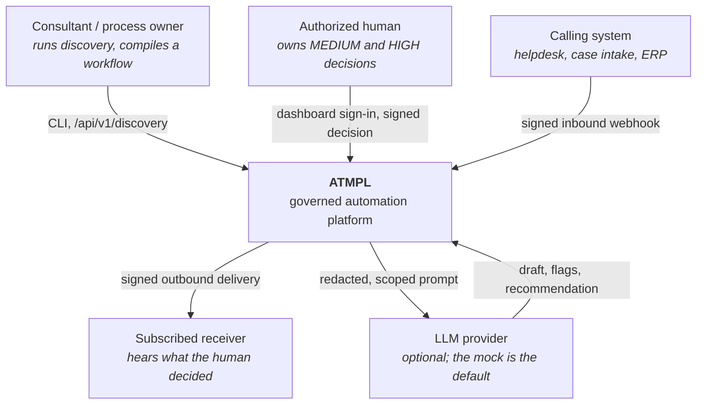
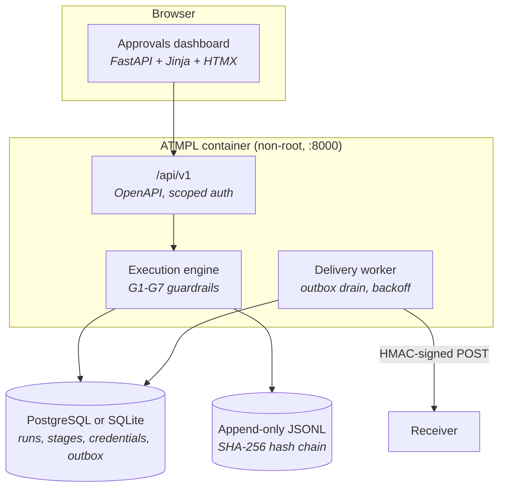
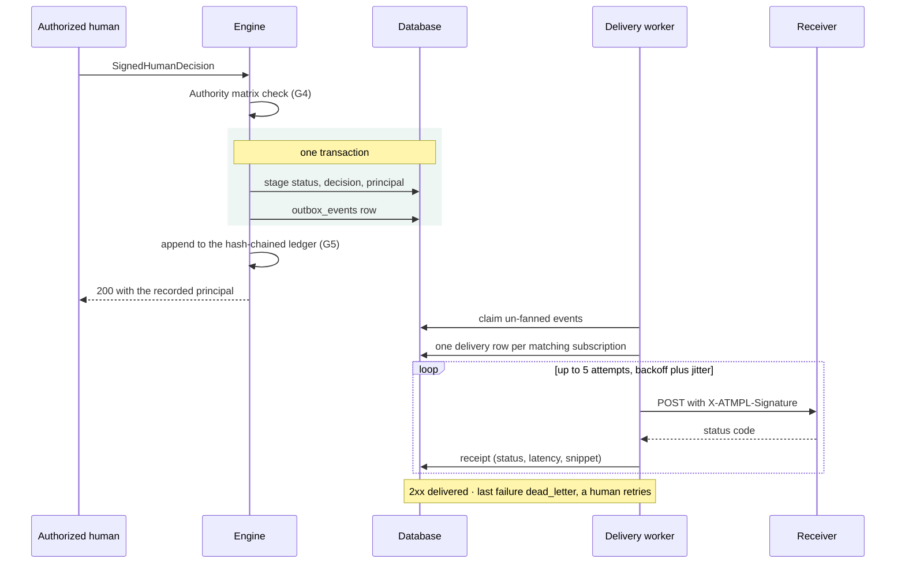

# Architecture

## C4 level 1 — context

## C4 level 2 — containers

## Trust boundaries

| Boundary | Crossing it requires | Enforced by |
|---|---|---|
| Internet → `/api/v1` | A scoped API key or an OAuth2 access token (`kid`-pinned, ≤ 15 min) | `security/dependencies.py` |
| Internet → `/api/v1/webhooks/{source}` | An HMAC-SHA256 signature over `<t>.<body>` inside a 5-minute window | `webhooks/signing.py` |
| Browser → dashboard mutation | A signed session cookie **and** a matching CSRF token | `web/app.py` |
| Any caller → a MEDIUM/HIGH transition | A `SignedHumanDecision` whose role is in the stage's authority matrix | `guardrails/decisions.py` |
| Engine → LLM provider | Deterministic pre-policy: redaction, region, scope, injection | `guardrails/policy.py` |
| LLM provider → engine | Deterministic post-policy: schema, bounds, size, forbidden content | `guardrails/policy.py` |
| Service → subscriber | A signature the receiver verifies with its own copy of the secret | `webhooks/outbox.py` |
| Anything → the ledger | Nothing: it is append-only, and every record hashes the one before | `audit.py` |

What no boundary protects against is listed in [SECURITY.md](../SECURITY.md) under
"What is deliberately NOT protected".

## The outbox: why a delivery can never claim more than the database did

The event and the state change commit together, so an event cannot describe a decision the
database rejected, and a decision cannot be silently unannounced. Delivery is **at-least-once**;
receivers deduplicate on `X-ATMPL-Delivery`.

## Design objective

ATMPL separates adaptation, generation, authority, and evidence. A client-specific workflow
is compiled from a reusable template and typed discovery answers. AI is one draft-producing
component inside that workflow; it is not the workflow controller or policy authority.

## Boundaries

| Boundary | Owns | Deliberately does not own |
|---|---|---|
| Template catalog | Ordered stages, risk tiers, roles, inputs, outputs, escalation, SLA hints, audit tags | Organization facts |
| Discovery resolver | Questions, typed answer validation, placeholder resolution, regional consistency | Guessing missing client answers |
| Execution engine | Persistent stage state, allowed transitions, adapter calls, audit emission | Final HIGH decisions |
| Policy engine | Redaction, scope/region checks, output schema, forbidden content, numeric bounds | Probabilistic judgment |
| LLM adapter | Drafts, extraction, flags, routing recommendations | Business transitions or approvals |
| Approval boundary | Signed human decision and authority-matrix check | Model-generated signatures |
| Audit ledger | Append-only ordered evidence and tamper detection | Data-retention policy for a real client |
| Dashboard | Read models and calls to the shared engine mutation API | Dashboard-only approval logic |
| `/api/v1` | Versioned resources, scopes, the error envelope, pagination | A second copy of any rule the engine owns |
| Credential store | Salted digests of API keys and client secrets, PBKDF2 passwords | Recoverable credentials |
| Webhook outbox | Durable events, fan-out, retries, receipts, dead-letter | Deciding what an event means |

## Data flow

1. `atmpl init` (or `POST /api/v1/discovery/sessions`) reflects over the selected Pydantic
   placeholder model and emits the questions plus a correctly shaped answer document.
2. `atmpl resolve` (or `PUT …/answers` then `POST …/resolve`) validates with `extra="forbid"`.
   Missing, empty, unknown, or type-invalid values become a numbered follow-up list.
3. The resolver substitutes `{{dotted.names}}`. Exact placeholders preserve their typed
   value; placeholders embedded in prose become strings.
4. The instantiated spec is persisted alongside its organization profile.
5. The engine creates ordered stage records. LOW deterministic actions have a dedicated
   completion function. AI actions pass through pre-policy, adapter, and post-policy, then
   attach a draft with `business_transition: false` in the audit event.
6. MEDIUM/HIGH decisions require `SignedHumanDecision`; the role is checked against the stage's
   compiled authority matrix, and the **authenticated principal** is recorded beside the
   signature, before state changes.
7. Every transition appends a JSONL record, mirrors it to the database for the dashboard, and
   — where a subscription matches — enqueues an outbox event in the same transaction.

## Persistence model

- `organizations`: profile, sector, organization kill switch, inbound webhook mappings.
- `workflows`: immutable compiled specification snapshot.
- `runs`: one workflow execution and its declared region.
- `stages`: action, risk, status, validated input, recorded evidence, AI draft, human decision.
- `audit_events`: database read model of the append-only JSONL event.
- `redteam_results`: seeded display of the executable R1–R8 outcomes.
- `discovery_sessions`: an in-progress questionnaire and the answers so far.
- `api_keys` / `oauth_clients`: salted digests only; no credential is recoverable.
- `outbox_events`: domain events, written in the transaction that produced them.
- `webhook_subscriptions` / `webhook_deliveries`: receivers, and one attempt log per event.
- `inbound_events`: the idempotency ledger for inbound webhooks.

Alembic owns the schema for a server deployment (`atmpl db upgrade`); the keyless SQLite demo
still creates its tables in-process, and `upgrade` baseline-stamps such a database rather than
re-running DDL against tables that already exist.

SQLite is the keyless default and the right choice for a local consultant prototype;
PostgreSQL is a first-class target and what `docker compose up` runs. **[INFERRED]** A
production deployment would still add an object-locked audit sink, identity claims from a real
IdP, a KMS for the signing keys, concurrency controls, metrics, backup/restore, and documented
retention.

**The ledger is a file.** It lives beside the database, not inside it. Compose mounts a named
volume for `/app/var` because a container rebuild otherwise leaves a populated database and no
ledger — at which point `atmpl audit verify` correctly reports the chain as missing. That is
the system working, and it was measured during this build.

## Failure behavior

The system fails closed:

- invalid discovery → no workflow;
- regional mismatch → no compilation or adapter call;
- prompt injection/scope failure → stage blocked and escalated;
- missing/malformed/oversized adapter output → stage blocked and escalated;
- unsigned HIGH request → HTTP 422 plus audit event;
- unauthorized role → rejected transition plus audit event;
- active kill switch → AI stage parked; human gates remain usable;
- audit mutation → verification returns non-zero and names the first broken line;
- missing or wrong webhook signature → 401, and no run is created;
- replayed idempotency key → the first result, and no second run;
- missing scope → 403 naming the scope required and the scopes granted;
- expired or unknown-`kid` token → 401 before any state is touched;
- form POST without a CSRF token while signed in → 403;
- receiver down or failing → retries with backoff, then `dead_letter` for a human — never a
  silently dropped event.

## Where the next layer attaches [INFERRED]

`AppContext` (`runtime.py`) is the single place a request handler reaches for the engine,
settings, secrets and limiter, so tracing, metrics and a provider router belong there rather
than in a module global. Provider selection is already a settings value (`ATMPL_ADAPTER`), and
the engine emits every domain event through one `event_sink` seam.
